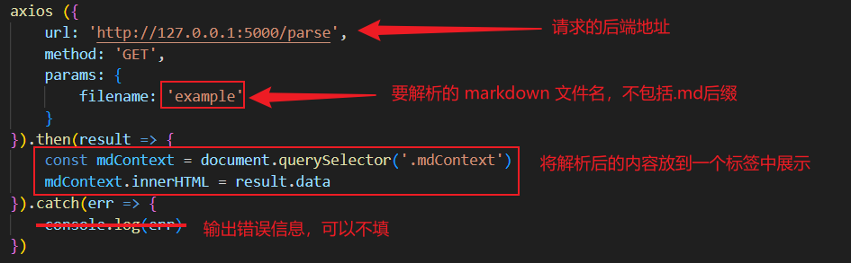
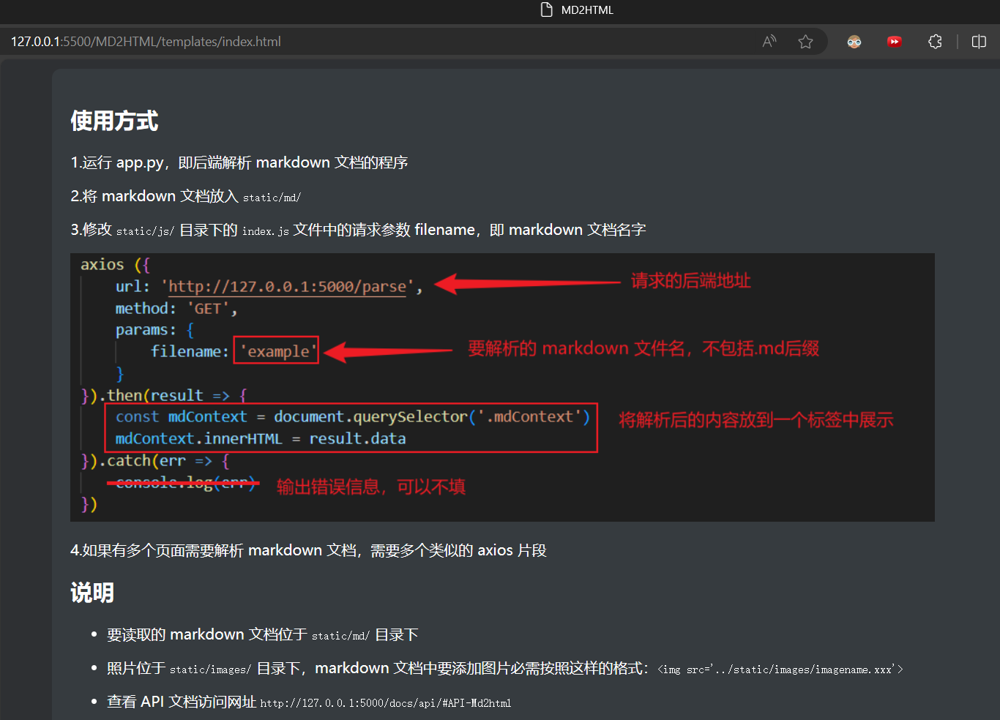

## 使用方式

1.将 markdown 文档放入 `static/md/` 

2.运行 app.py，即后端解析 markdown 文档的程序

3.修改 `static/js/` 目录下的 `index.js` 文件中的请求参数 filename，即 markdown 文档名字

4.如果有多个页面需要分别解析 markdown 文档，需要多个类似的 axios 片段

5.markdown 渲染的网页在本地网址的 5000 端口：`http://127.0.0.1:5000/`

 

## 说明

* 要读取的 markdown 文档位于 `static/md/` 目录下

- 照片位于 `static/images/` 目录下，markdown 文档中要添加图片必需按照这样的格式：``
- 查看 API 文档访问网址（运行 app.py 后） `http://127.0.0.1:5000/docs/api/#API-Md2html`

## 效果展示

> 网页上的视图

